# Mastermind Bot Classification
In this project, we use machine learning classification techniques to identify the intelligence level of a bot playing Mastermind. After some initial exploratory visualisation, we build a simple logistic regression model first. After noting that this model struggles to successfully classify one of the intelligence levels, we construct three further models using a combination of XGBoost and hyperparameter tuning.

For a brief overview, see below. For the details of the project, see [main_project_notebook.ipynb](main_project_notebook.ipynb) (or [verbose_project_notebook.ipynb](verbose_project_notebook.ipynb) for the version with verbose outputs).

The training data or this project was generated by a Python game built previously - see [mastermind_game.py](mastermind_game.py).

### License

### Languages

### Major Libraries

---

## Project Overview
The aim of this project is to see how well a machine learning model can classify a set of relatively incompetent bots playing Mastermind. A bot playing randomly versus a bot playing optimally would be too easy for a classifier model to identify, so instead, we constructed an algorithm for bots playing at the following three bot intelligence (BI) levels:
* BI 0: randomly guesses each turn
* BI 1: randomly selects from allowed moves following previous turn
* BI 2: randomly selects from allowed moves following best previous turn

### Quick Note on the Gameplay Mechanics

As in a standard game of Mastermind, the player (in this case, the bot) must make a guess of four consecutive colours each turn, and wins when the guess matches the pre-determined solution. After each turn, the player is provided with an evaluation of up to four colours. Red corresponds to the player having guessed the correct colour in the correct ordinal position, and white corresponds to the player having guessed a correct colour but in the incorrect ordinal position - see an example game below.

The evaluation restricts the possible combinations the player can select from in the next turn. BI 1 and BI 2 both follow this restriction, whereas BI 0 simply ignores the evaluation and just guesses randomly.

In addition, each possible evaluation has been given a corresponding score from 0 to 11 (with 11 being a fully correct guess). The scoring system was determined by the rank order of the number of possible moves permitted following each evaluation. BI 2 uses this scoring system to rank all turns and return to the best previous turn (i.e. with the highest score). See the conversion of evaluations to scores below.

<table style="border-collapse: collapse; background-color: white;">
  <tr>
    <th style="text-align: center; font-weight: bold; padding-bottom: 10px;">Example Game</th>
    <th style="text-align: center; font-weight: bold; padding-bottom: 10px;">Scoring System</th>
  </tr>
  <tr>
    <td style="padding-right: 20px; vertical-align: top; background-color: white;">
      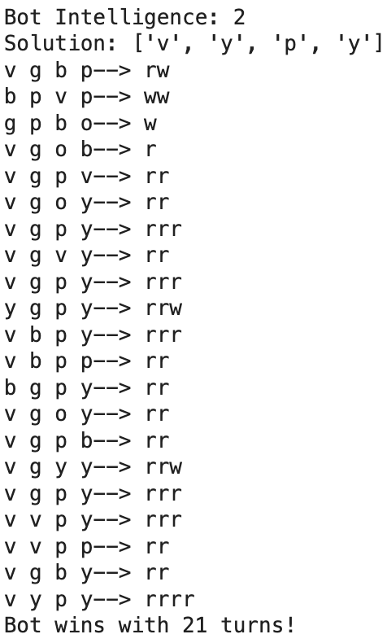
    </td>
    <td style="vertical-align: top; background-color: white;">
      <table border="1" cellpadding="4" cellspacing="0" style="border-collapse: collapse; width: 100%;">
        <tr style="background-color: white;">
          <th>Evaluation</th>
          <th>Score</th>
        </tr>
        <tr><td>None</td><td>0</td></tr>
        <tr><td>w</td><td>1</td></tr>
        <tr><td>ww</td><td>2</td></tr>
        <tr><td>r</td><td>3</td></tr>
        <tr><td>rw</td><td>3</td></tr>
        <tr><td>www</td><td>4</td></tr>
        <tr><td>rr</td><td>5</td></tr>
        <tr><td>rww</td><td>5</td></tr>
        <tr><td>rrw</td><td>6</td></tr>
        <tr><td>rrr</td><td>7</td></tr>
        <tr><td>wwww</td><td>8</td></tr>
        <tr><td>rwww</td><td>9</td></tr>
        <tr><td>rrww</td><td>10</td></tr>
        <tr><td>rrrr</td><td>11</td></tr>
      </table>
    </td>
  </tr>
</table>

To view the Python code of the bots playing the game, see the file [mastermind_game.py](mastermind_game.py) (feel free to fork and adjust parameters yourself). Throughout the project documented here, we will be using the setting where bots are limited to 100 turns per game.

### Visualising the Training Data

A quick run of 100 games (with each bot playing about a third of the games) shows that the bots are clearly differentiated by the average speed at which they reach a perfect score of 11:

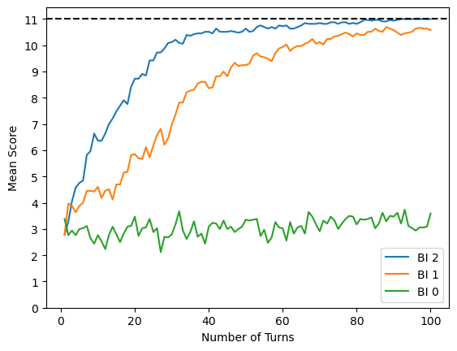

For the purposes of training the classifiers in this project, we ran 200000 games (again split equally among the bots) - to view this training data, see [Mastermind_100_Turns.csv](Mastermind_100_Turns.csv). A clear trend emerges (see below left) - the average score of BI 2 reaches its maximum value after about 50 turns, with BI 1 and BI 0 catching up at a progressively slower pace respectively.

However, although BI 2 has nearly reached a perfect score after the limit of 100 turns, and BI 0 an average score of only about 3, BI 1 interestingly has two local maxima, (with a skew towards higher mean scores after 100 turns) - see below right. This may be explained by the observation that while BI 1 tends to eventually win, it has a subset of games where it gets stuck in bad guesses (hence the lower maximum). This makes sense, since although BI 1 tries to improve on its current turn, it never takes into account its best prior guess, and so fails to reliably build on its successes.

| 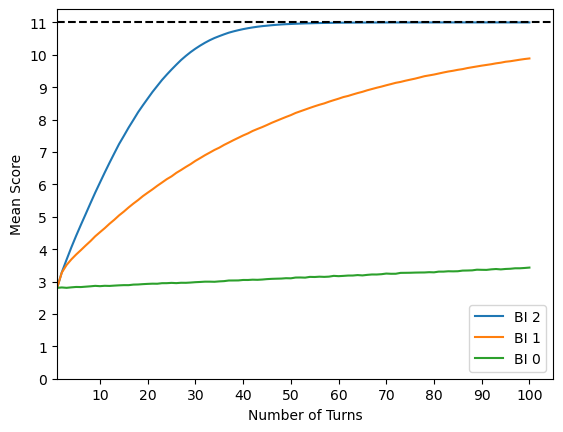 | 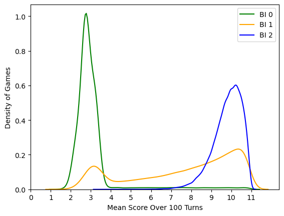 |
|:--:|:--:|

Given the distinctions identified, we should expect models to clearly separate BI 0 and BI 2, while producing a slighter higher number of false negative predictions for BI 1.

### Model 1: Logistic Regression

We start with a simple classification model - logistic regression. This will allow us to get an idea of the ballpark accuracy we attain given the training data, without diving into a more complicated model yet. To reduce the risk of overfitting, we manually implement early stopping by running logistic regression iteratively so we can evaluate the consecutive loss fall per iteration, relative to a validation set. Throughout this project, we use a train:validation:test ratio of 0.8:0.1:0.1.

The algorithm stopped after 15 iterations, attaining an accuracy of 0.7462. The classification report shows a very low recall for BI 1, which falls in line with our prediction from the KDE plot above. As can be seen on the confusion matrix below, the model is most likely to misclassify BI 1 as BI 2.

| 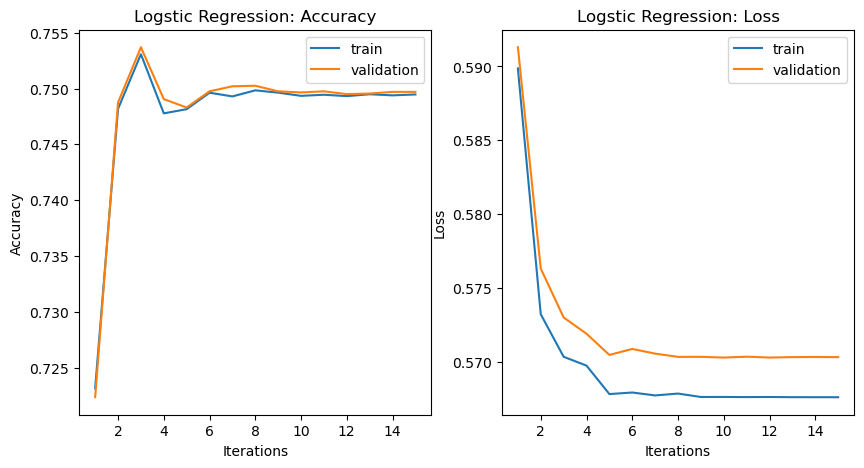 | 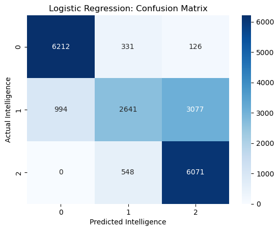 |
|:--:|:--:|

### Model 2: XGBoost

The next model uses XGBoost - compared to logistic regression, this should be better at handling any non-linearities, feature interactions and outliers. There are certainly some outliers in our dataset (e.g. lucky first tries!), as well as feature interactions (e.g. BI 2 referring back to the maximum previous evaluation score).

After about 100 epochs, this model attained an accuracy of 0.8334 - an improvement! Notably, the recall for BI 1 has now risen from 0.39 to 0.63, a fact reflected in the confusion matrix that show the model is most likely to correctly classify BI 1.

| 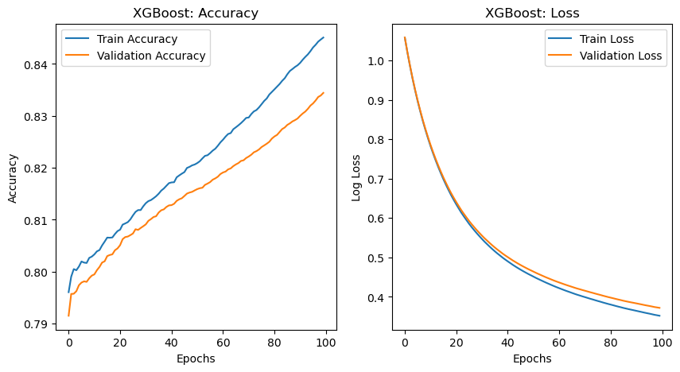 | 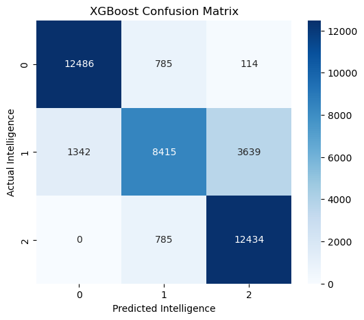 |
|:--:|:--:|

### Model 3: XGBoost with Random Search

Given that there are still too many misclassifications of BI 1 as BI 2 (see the confusion matrix above), we delve into some hyperparameter tuning using RandomizedSearchCV. This uses cross-validation on the training data to identify the best parameters given a defined range of possible parameters. The separate validation set is later used for early stopping, as usual.

With this method, the model attained an accuracy of 0.9119 after about 250 epochs - a significant improvement. The recall for BI 1 is now at 0.82, and the model appears to be able to clearly distinguish between the three bot intelligences.

| 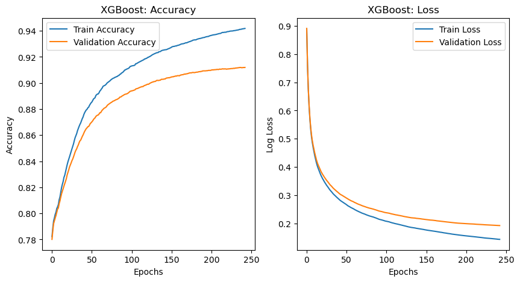 | 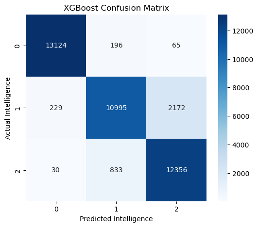 |
|:--:|:--:|

### Model 4: XGBoost with Bayesian Optimisation

Since the previous round of hyperparameter tuning was so successful, we try to optimise them once more with the more computationally demanding Bayesian Optimisation. This algorithm is less random, instead leveraging previous evaluations to find the best set of hyperparameters.

With this final method, the model attained an accuracy of 0.9127 after about 300 epochs. Given the more marginal improvement this time, we take this to be the final model for this project.

| 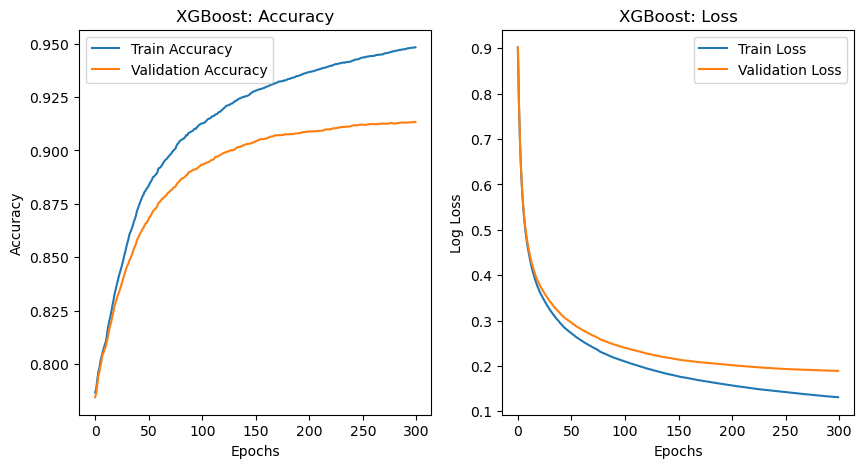 | 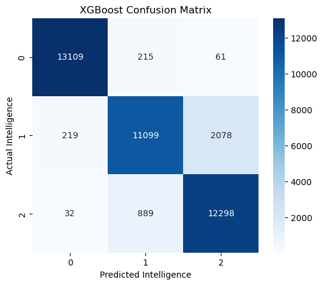 |
|:--:|:--:|

### Summary and Next Steps

Our classification models were faced by the challenge of BI 1, which can exhibit some less predictable behaviour - sometimes it wins quickly, by chance, whilst other times, it takes longer.

Logistic regression does a good job at separating BI 0 and BI 2, but struggles with BI 1, given its bimodal distribution. XGBoost with hyperparameter tuning performs much better, yielding higher accuracy overall, and mitigating some of the misclassification of BI 1.

Suggestions for future exploration:
* Vary the maximum number of turns each bot can make - how much does model performance improve if bots are allowed to take 1000 turns (and so become more distinguishable)? How about if they can only take 8 turns, like in classic mastermind - can the model distinguish them at all?
* Export game states or evaluations instead of just scores - does this improve model performance?

